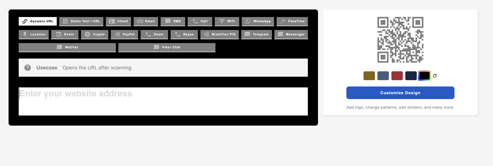

# Add the frontend QR Generator component to any website

This can be done by loading the dashboard assets and then adding a single html tag to your website.

```html
<script
  async
  src="https://yourwebsite.com/integration/dashboard-assets.js"
></script>

<qrcg-website-banner></qrcg-website-banner>
```

### Customisation

Components are built on top of Custom HTML components technology. So light dom CSS rules won't apply to them.

We have built a system to inject your own styles in the shadow dom of some element. No matter how deep the element in the shadow dom is.

You will have to place a style tag in the head section of the document as following:

```html
<style class="CUSTOM_ELEMENT_TAG_NAME-custom-style">
  .child-shadow-dom-selector {
    /** Your custom rules go here. **/
  }
</style>
```

Any style tag with the class with this naming convenient will be injected to the element's shadow dom, allowing you to customize the component with no limits.

Check customized.html file source code for full example.


