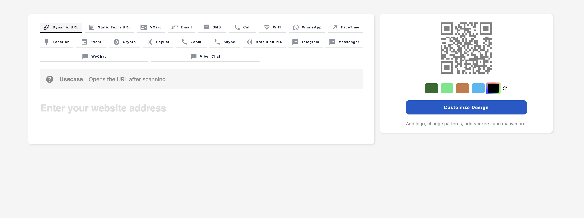

# Add the frontend QR Generator component to any website

You can add the home page generator to any html page by following the steps below:

1. Include the main JavaScript bundle.
2. Add configuration object to the head tag.
3. Add the `qrcg-website-banner` tag to your html page.
4. Copy the default QR code image and place it next to your page.

### Include the main JavaScript bundle

To get the main script link, you should have installed your Quick Code installation on a domain that is accessible from the internet, and then you may go to your website, right click on the webpage and click on view source.

Find the line which contains the keyword `bundle-` and then copy the script tag itself.

Example

```javascript
<script async src="https://youdomain.com/bundle-27ec71b2.js"></script>
```

Add this script tag to your website before closing the head tag.

### Add configuration object to the head tag

Create the following JavaScript object right before the above script tag.

```html
<script>
  const CONFIG = {
    // Replace yourdomain.com with your actual domain
    "config.app.url": "http://yourdomain.com",
    "config.app.name": "Quick Code",
    "config.frontend.slogan": "QR Code Generator",
  };
</script>
```

### Add the `qrcg-website-banner` tag to your html page.

Add the following html custom element at any position you would like.

```html
<qrcg-website-banner></qrcg-website-banner>
```

### Copy the default QR code image and place it next to your page.

When extracting the files you have downloaded after purchasing the script, you will find a folder named: `frontend-src.zip`

Extract this folder and copy the default image

```bash
cd your-project-directory

mkdir -p assets/images

cp -r /path/to/frontend-src/assets/images/default-qrcode-placeholder.png assets/images
```

### Screenshot

The result should look like the following



### Customisation

Components are built on top of Custom HTML components technology. So light dom CSS rules won't apply to them.

We have built a system to inject your own styles in the shadow dom of some element. No matter how deep the element in the shadow dom is.

You will have to place a style tag in the head section of the document as following:

```html
<style class="CUSTOM_ELEMENT_TAG_NAME-custom-style">
  .child-shadow-dom-selector {
    /** Your custom rules go here. **/
  }
</style>
```

Any style tag with the class with this naming convenient will be injected to the element's shadow dom, allowing you to customize the component with no limits.

Check customized.html file source code for full example.


